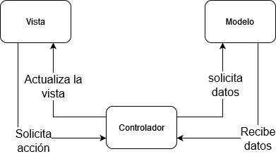

# Arquitecturas

Existen numerosas maneras de ordenar y priorizar nuestro codigo. A estas formas se las llama [Arquitecturas de software](https://es.wikipedia.org/wiki/Arquitectura_de_software)/

En la actualidad existen numerosos estandards para el desarrollo de aplicaciones en iOS, en este capitulo se ha recreado el mismo proyecto, con las mismas funcionalidades, aplicando distintas arquitecturas. A continuacion habra una breve explicacion de cada una.

## MVC: Modelo Vista Controlador

La arquitectura MVC fue durante algunos años la arquitectua a la que Apple favorecio con su framework UIkit, es una arquitectura versatil y facil de implementar. La conforman tren partes diferenciadas:
- Modelo: Datos que utilizan para obtener la informacion que de forma interna utiliza la app
- Vista: Es la parte visual de la app
- Controlador: Es el mediador ente la Vista y el Modelo, lo que llamariamos la logica de la app. Esta barrera entre vista y modelo nos facilita reutilizar modelos y vistas mas facilmente y garantiza la separacion de responsabilidades a lo largo de la app

Para informacion directa de Apple sobre esta arquitectura podemos consultar [la documentacion oficial](https://developer.apple.com/library/archive/documentation/General/Conceptual/CocoaEncyclopedia/Model-View-Controller/Model-View-Controller.html)

## MVC-C: Modelo vista controlador con cordinadores

## MVP: Modelo Vista Presentador

## MVVM: Vista ViewModel Modelo

## Viper: View Iteractor Presenter Entities Router

## RIBS, the composable architecture
/ribs.png)
